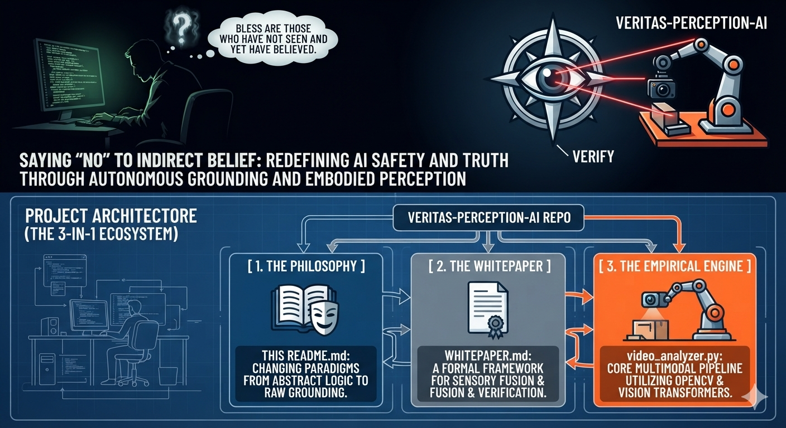

### Veritas-Perception-AI

**"Saying 'No' to Indirect Belief: Redefining AI Safety and Truth Through Autonomous Grounding and Embodied Perception."** 

### 👁️ The Philosophy: The Paradox of the Professor in the Dark Room

Current mainstream Artificial Intelligence models operate under a dangerous epistemology: **"Blessed are those who have not seen and yet have believed."** Built almost exclusively on text-based corporate corpora and disembodied sequence-prediction algorithms, state-of-the-art Large Language Models (LLMs) act like a **highly erudite Professor confined to a permanently dark room**. 

If you feed this Professor a text transcript or an unverified hearsay summary of a deepfake video—such as simulated or staged geopolitical or academic debates—the Professor will analyze its syntax flawlessly, construct elegant semantic arguments, and blindly accept the premise as absolute truth. 

**This is the death of information.** In a hyper-connected world where text, video, and digital media can be seamlessly generated and weaponized, an intelligence without direct, autonomous physical verification is not truly intelligent; it is merely a complex stochastic parrot operating a mechanical processing machine. 

As future scientists, **we reject indirect belief.** True scientific inquiry dictates absolute skepticism until empirical, first-hand verification is achieved. **Veritas-Perception-AI** is an architectural proof-of-concept that establishes vision and multi-modal sensory perception as the absolute, non-negotiable foundation of machine intelligence. Without a sensory interface to actively ground itself in the physical constraints of reality, AI remains structurally blind—vulnerable to systemic deception and capable of catastrophic societal downstream effects. 

### 🏗️ Project Architecture (The 3-in-1 Ecosystem)

This repository unites theory, governance, and empirical software engineering into a unified framework to combat disembodied information decay: 

                  ┌────────────────────────────────────────┐
                  │      VERITAS-PERCEPTION-AI REPO        │
                  └───────────────────┬────────────────────┘
                                      │
         ┌────────────────────────────┼────────────────────────────┐
         ▼                            ▼                            ▼
  [ 1. THE PHILOSOPHY ]       [ 2. THE WHITEPAPER ]       [ 3. THE EMPIRICAL ENGINE ]
  This README.md: Changing    WHITEPAPER.md: A formal      video_analyzer.py: Core 
  paradigms from abstract     framework for Sensory        multimodal pipeline utilizing
  logic to raw grounding.     Fusion & Verification.       OpenCV & Vision Transformers.

1. **The Manifest (README.md):** Re-centering the AI development narrative away from pure compute/parameter scaling and back toward sensory autonomy.
2. **The Framework (WHITEPAPER.md):** A rigorous architectural proposal exploring the "Sensory Fusion Layer"—arguing why hardware chips and software algorithms will inevitably plateau without autonomous vision pipelines to ground them.
3. **The Empirical Engine (video_analyzer.py):** An independent Python implementation that bypasses text prompt injections by forcefully breaking down video feeds into native tensor representations, extracting physical pixel anomalies, and executing autonomous verification.

### 🛠️ Empirical Core Engine: How It Works

Instead of relying on pre-packaged human captions or textual interpretations, Veritas-Perception-AI implements a strict **Sensory Verification Pipeline**: 

* **Vision Pipeline:** Utilizes OpenCV to deconstruct incoming video files into raw, chronological matrix frames, preventing text-level hallucination or prompt manipulation.
* **Feature Extraction Layer:** Maps frame matrices directly into a high-dimensional semantic-visual space via a Vision Transformer (ViT/CLIP), checking for light scattering inconsistencies, edge blending, and deepfake artifacts.
* **Perceptual Decision Matrix:** Cross-references visual indicators against empirical baselines to determine whether the source media is an organic physical event or a synthetic generation.

### 🚀 Getting Started

### Prerequisites

Ensure your local environment is configured with CUDA if executing deep visual inspections on high-resolution streams. 

bash

pip install -r requirements.txt

Use code with caution.

### Execution

To force the AI to directly analyze a digital stream or video file rather than reading a text transcript: 

bash

python video_analyzer.py --video_path "your_target_media.mp4"

Use code with caution.

### 📑 Intellectual Lineage & Context

This project serves as an active conceptual extension to our broader open-source ecosystem dedicated to autonomous infrastructure, data integrity, and decentralized governance: 

* [aura-health-ambient](https://github.com/binxixi23/aura-health-ambient) - Grounding health metrics via ambient environment sensing.
* [omniid-v2x-infrastructure](https://github.com/binxixi23/omniid-v2x-infrastructure) - Physical consensus and identity protocols for vehicle-to-everything communication.
* [fake_or_real](https://github.com/binxixi23/fake_or_real) - Empirical detection mechanisms for synthetic assets.
* [VoxPopuli-AI-Governance](https://github.com/binxixi23/VoxPopuli-AI-Governance) - Frameworks for trustworthy, verifiable societal automation.

*Developed under the unwavering principle of scientific empiricism: **Veritas per Perceptionem** (Truth through Perception).*